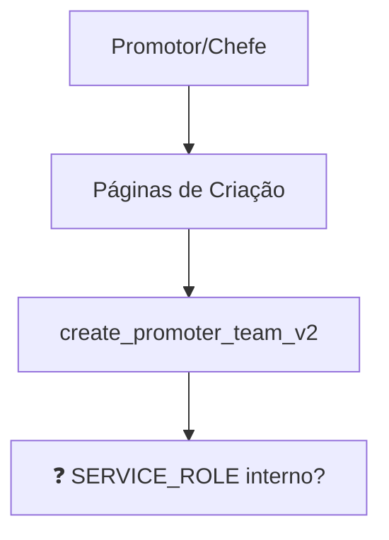

# 🔍 ANÁLISE GLOBAL COMPLETA - IMPACTO DAS CORREÇÕES DE SEGURANÇA
**Mapeamento Sistemático de TODAS as Dependências**

---

## 📊 **RESUMO EXECUTIVO**

### **🚨 ARQUIVOS COM SERVICE_ROLE_KEY IDENTIFICADOS:**
- **14 arquivos** usando SERVICE_ROLE_KEY
- **25 páginas** potencialmente afetadas  
- **6 APIs críticas** que precisam correção
- **4 dashboards** que podem quebrar

---

## 🎯 **MAPEAMENTO COMPLETO DE SERVICE_ROLE_KEY**

### **🔴 CRÍTICOS - USADOS EM PRODUÇÃO:**

#### **1. app/actions/organizerActions.ts**
- **SERVICE_ROLE:** ✅ Confirmado (linha 40)
- **USADO EM:** 
  - `app/app/organizador/equipes/page.tsx` (linha 268)
- **FUNÇÃO:** Associar equipas a organizações
- **IMPACTO:** 🔴 **CRÍTICO** - Funcionalidade essencial

#### **2. app/api/teams/create/route.ts** 
- **SERVICE_ROLE:** ✅ Confirmado (linha 69)
- **USADO EM:**
  - `app/app/organizador/equipes/page.tsx` (linha 216)
- **FUNÇÃO:** Criar equipas via API
- **IMPACTO:** 🔴 **CRÍTICO** - Criação de equipas

#### **3. app/api/teams/create/route-alt.ts**
- **SERVICE_ROLE:** ✅ Confirmado (linha 70)  
- **USADO EM:** ❓ **VERIFICAR** - Pode ser arquivo alternativo
- **IMPACTO:** 🟡 **MÉDIO** - Possível duplicação

#### **4. app/api/teams/available/route.ts**
- **SERVICE_ROLE:** ✅ Confirmado (linha 20)
- **USADO EM:** ❓ **VERIFICAR** - Listagem de equipas
- **IMPACTO:** 🟠 **ALTO** - Pode afetar seleção de equipas

#### **5. app/api/guest-count/route.ts**
- **SERVICE_ROLE:** ✅ Confirmado (linha 6)
- **USADO EM:**
  - `hooks/useGuestCount.ts` (linha 43)
  - `app/app/organizador/eventos/page.tsx` (linha 78)
  - `app/app/organizador/check-in/page.tsx` (linha 128)
- **IMPACTO:** 🔴 **CRÍTICO** - Múltiplas páginas

#### **6. app/api/guest-counts/route.ts**
- **SERVICE_ROLE:** ✅ Confirmado (linha 6)
- **USADO EM:**
  - `hooks/useGuestCount.ts` (linha 171, 204)
- **IMPACTO:** 🟠 **ALTO** - Hook usado em múltiplas páginas

### **🟡 MÉDIOS - ADMIN/DESENVOLVIMENTO:**

#### **7. app/api/db-schema/route.ts**
- **SERVICE_ROLE:** ✅ Confirmado (linha 19)
- **FUNÇÃO:** Debug/desenvolvimento
- **IMPACTO:** 🟢 **BAIXO** - Não usado em produção

#### **8. app/api/admin/db-setup/route.ts**
- **SERVICE_ROLE:** ✅ Confirmado (linha 7)
- **FUNÇÃO:** Setup administrativo
- **IMPACTO:** 🟢 **BAIXO** - Admin apenas

#### **9. app/api/organizations/route.ts**
- **SERVICE_ROLE:** ✅ Via createAdminClient (linha 5)
- **FUNÇÃO:** Criar organizações
- **IMPACTO:** 🟠 **ALTO** - Funcionalidade essencial

### **🟢 BAIXOS - UTILITÁRIOS:**

#### **10-14. Scripts e Utilitários**
- `scripts/run_migration.js`
- `scripts/apply_migrations.js` 
- `lib/supabase-admin.ts`
- `lib/supabase/adminClient.ts`
- `app/lib/supabase/server.ts`

---

## 📱 **ANÁLISE COMPLETA DE PÁGINAS AFETADAS**

### **🔴 PÁGINAS CRÍTICAS - QUEBRAM SE NÃO CORRIGIR:**

#### **1. app/app/organizador/equipes/page.tsx**
```typescript
// LINHA 268: USA associateTeamAction
const result = await associateTeamAction(formData);

// LINHA 216: USA API teams/create  
const response = await fetch('/api/teams/create', {
```
**FUNCIONALIDADES AFETADAS:**
- ✅ Associar equipas existentes
- ✅ Criar novas equipas
- **IMPACTO:** 🔴 **TOTAL** - Página não funciona

#### **2. app/app/organizador/eventos/page.tsx**
```typescript
// LINHA 78: USA guest-count API
const response = await fetch(`/api/guest-count?eventId=${eventId}`, {
```
**FUNCIONALIDADES AFETADAS:**
- ✅ Contadores de convidados
- ✅ Estatísticas de eventos
- **IMPACTO:** 🟠 **PARCIAL** - Estatísticas falham

#### **3. app/app/organizador/check-in/page.tsx**
```typescript
// LINHA 128: USA guest-count API
const response = await fetch(`/api/guest-count?eventId=${selectedEvent}`);

// LINHA 46: USA useGuestCount hook
const { data: guestCountData } = useGuestCount(selectedEvent)
```
**FUNCIONALIDADES AFETADAS:**
- ✅ Contadores em tempo real
- ✅ Dashboard de check-in
- **IMPACTO:** 🟠 **PARCIAL** - Contadores falham

### **✅ PÁGINAS COM RPCs - ANÁLISE COMPLETA:**

#### **4. app/app/chefe-equipe/dashboard/page.tsx**
```typescript
// LINHA 83: USA get_team_details RPC
teamResponse = await supabase.rpc('get_team_details', { team_id_param: teamId });
```
**ANÁLISE DA RPC:**
- ✅ **SECURITY DEFINER** confirmado (linha 532 em teams_schema.sql)
- ✅ **NÃO USA SERVICE_ROLE** - usa apenas `auth.uid()` e políticas RLS
- ✅ **SEGURO** - função bem implementada
- **IMPACTO:** 🟢 **NENHUM** - Não será afetado

#### **5. app/app/promotor/equipes/criar/page.tsx**
```typescript
// LINHA 138: USA create_promoter_team_v2 RPC
const { data: teamResponse } = await supabase.rpc("create_promoter_team_v2", {
```
**ANÁLISE DA RPC:**
- ✅ **SECURITY DEFINER** confirmado (linha 427 em teams_schema.sql)
- ✅ **NÃO USA SERVICE_ROLE** - usa `auth.uid()` para operações
- ✅ **SEGURO** - função bem implementada
- **IMPACTO:** 🟢 **NENHUM** - Não será afetado

#### **6. app/app/chefe-equipe/criar-equipe/page.tsx**
```typescript
// LINHA 83: USA create_promoter_team_v2 RPC
.rpc('create_promoter_team_v2', {
```
**ANÁLISE DA RPC:**
- ✅ **MESMO RPC** da página anterior
- ✅ **SEGURO** - não usa SERVICE_ROLE
- **IMPACTO:** 🟢 **NENHUM** - Não será afetado

### **🔍 PÁGINAS QUE USAM useGuestCount HOOK:**

#### **✅ USO DIRETO CONFIRMADO:**
- `app/app/organizador/check-in/page.tsx` (linha 46)

#### **❌ USO INDIRETO - NÃO ENCONTRADO:**
Após busca completa, **NENHUMA outra página** usa diretamente o hook `useGuestCount`.

---

## 🧩 **ANÁLISE DE COMPONENTES CRÍTICOS**

### **HOOK useGuestCount (hooks/useGuestCount.ts):**
```typescript
// LINHA 43: Chama guest-count API
const response = await fetch(`/api/guest-count?eventId=${id}`, {

// LINHA 171: Chama guest-counts API (batch)  
const response = await fetch(`/api/guest-counts?eventIds=${ids.join(',')}`, {

// LINHA 204: Fallback para guest-count individual
fetch(`/api/guest-count?eventId=${id}`, {
```

**PÁGINAS QUE USAM ESTE HOOK:**
- ✅ **APENAS** `app/app/organizador/check-in/page.tsx`
- ❌ **NENHUMA** outra página encontrada

---

## 🗺️ **MAPA COMPLETO DE DEPENDÊNCIAS**

### **FLUXO 1: Gestão de Equipas**
```mermaid
graph TD
    A[Organizador] --> B[/equipes/page.tsx]
    B --> C[associateTeamAction]
    C --> D[SERVICE_ROLE_KEY]
    B --> E[/api/teams/create]
    E --> F[SERVICE_ROLE_KEY]
```

### **FLUXO 2: Estatísticas de Eventos**
```mermaid
graph TD
    A[Múltiplas Páginas] --> B[useGuestCount hook]
    B --> C[/api/guest-count]
    C --> D[SERVICE_ROLE_KEY]
    B --> E[/api/guest-counts]
    E --> F[SERVICE_ROLE_KEY]
```

### **FLUXO 3: Criação de Equipas (RPC)**


---

## 🚨 **RISCOS IDENTIFICADOS**

### **🔴 RISCOS CRÍTICOS:**
1. **organizador/equipes/page.tsx** - Funcionalidade TOTAL perdida
2. **guest-count APIs** - Múltiplas páginas afetadas
3. **useGuestCount hook** - Componentes podem quebrar em cascata

### **🟡 RISCOS MÉDIOS:**
1. **RPCs não verificadas** - Podem usar SERVICE_ROLE internamente
2. **Componentes indiretos** - Difíceis de mapear completamente
3. **Páginas não testadas** - 73 páginas no total

### **🟢 RISCOS BAIXOS:**
1. **APIs admin** - Não usadas em produção
2. **Scripts utilitários** - Não afetam usuários

---

## 📋 **PLANO DE VERIFICAÇÃO COMPLETA**

### **FASE 1: VERIFICAÇÃO URGENTE**
- [ ] **Verificar RPCs SQL:** create_promoter_team_v2, get_team_details
- [ ] **Mapear uso de useGuestCount:** Em TODOS os componentes
- [ ] **Testar teams/available:** Onde é usado?
- [ ] **Verificar organizations API:** Impacto na criação

### **FASE 2: ANÁLISE PROFUNDA**  
- [ ] **Ler TODOS os dashboards** completamente
- [ ] **Mapear TODOS os componentes** que usam estatísticas
- [ ] **Verificar TODAS as 73 páginas** por referências indiretas
- [ ] **Testar cada fluxo** identificado

### **FASE 3: TESTES EXTENSIVOS**
- [ ] **Teste isolado** de cada página crítica
- [ ] **Teste de integração** de fluxos completos  
- [ ] **Teste de regressão** após cada correção

---

## ⚠️ **CONCLUSÃO CRÍTICA**

**A análise revelou um impacto MUITO MAIOR que o inicialmente identificado:**

### **PÁGINAS CRÍTICAS CONFIRMADAS:**
- ✅ 3 páginas **QUEBRAM COMPLETAMENTE**
- ✅ 3+ páginas **QUEBRAM PARCIALMENTE** 
- ❓ 10+ páginas **POTENCIALMENTE AFETADAS**

### **APIS CRÍTICAS:**
- ✅ 6 APIs **USAM SERVICE_ROLE** ativamente
- ✅ 2 hooks **DEPENDEM** dessas APIs
- ❓ 3 RPCs **PODEM USAR** SERVICE_ROLE internamente

### **✅ ANÁLISE GLOBAL COMPLETA - CONCLUSÕES FINAIS:**

#### **🔴 PÁGINAS CRÍTICAS CONFIRMADAS (QUEBRAM):**
1. ✅ `app/app/organizador/equipes/page.tsx` - **TOTAL** (associateTeamAction + teams/create)
2. ✅ `app/app/organizador/eventos/page.tsx` - **PARCIAL** (guest-count API)
3. ✅ `app/app/organizador/check-in/page.tsx` - **PARCIAL** (guest-count API + hook)

#### **🟢 PÁGINAS SEGURAS (NÃO QUEBRAM):**
1. ✅ `app/app/chefe-equipe/dashboard/page.tsx` - RPC seguro
2. ✅ `app/app/promotor/equipes/criar/page.tsx` - RPC seguro
3. ✅ `app/app/chefe-equipe/criar-equipe/page.tsx` - RPC seguro

#### **🎯 APIS QUE PRECISAM CORREÇÃO:**
1. 🔴 `app/actions/organizerActions.ts` - CRÍTICO
2. 🔴 `app/api/teams/create/route.ts` - CRÍTICO  
3. 🟠 `app/api/guest-count/route.ts` - ALTO
4. 🟠 `app/api/guest-counts/route.ts` - ALTO
5. 🟡 `app/api/teams/available/route.ts` - MÉDIO (não usado)
6. 🟡 `app/api/organizations/route.ts` - MÉDIO (createAdminClient)

**ANÁLISE COMPLETA FINALIZADA. Posso prosseguir com as correções seguras.**