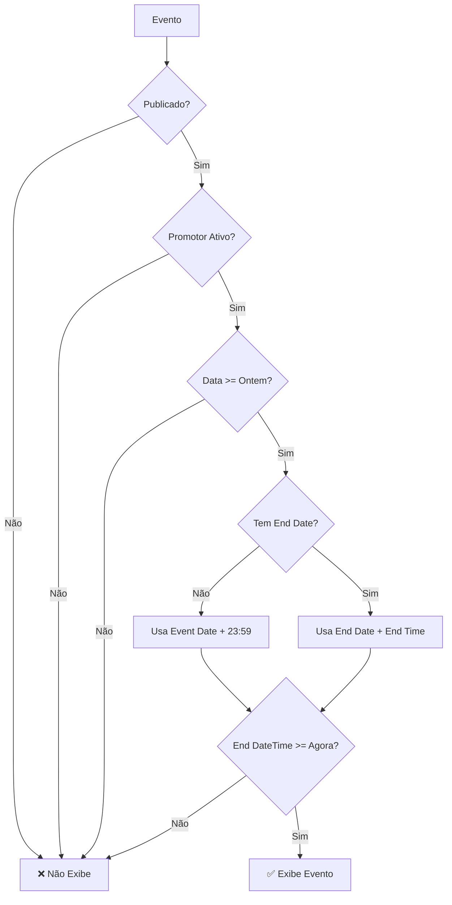

# 📊 ANÁLISE COMPLETA - PÁGINA PÚBLICA DOS PROMOTORES
## **MÉTRICAS E CONFIGURAÇÕES DEFINIDAS PARA EVENTOS PRÓXIMOS**

---

## 🎯 **RESUMO EXECUTIVO**

### **📍 URLs Analisadas:**
- **Página Principal do Promotor**: `/promotor/[userId]` ou `/promotor/[slug]`
- **Página de Evento Específico**: `/promotor/[userId]/[eventSlug]`

### **🏗️ Arquivos Principais:**
- `app/promotor/[userId]/page.tsx` (Página principal do promotor)
- `app/promotor/[userId]/PromoterProfile.tsx` (Componente de perfil)
- `app/promotor/[userId]/EventsList.tsx` (Lista de eventos)
- `supabase/migrations/20240523153500_create_get_public_promoter_page_data_function.sql` (Função SQL)

---

## 🔍 **MÉTRICAS DEFINIDAS PARA EVENTOS PRÓXIMOS**

### **🗄️ 1. MÉTRICAS DE BASE DE DADOS (SQL)**

#### **📊 Critérios de Filtragem Principal:**
```sql
-- ✅ FILTRO TEMPORAL PRINCIPAL
WHERE e.is_published = TRUE
AND e.date >= CURRENT_DATE - INTERVAL '1 day'
ORDER BY e.date ASC, e.time ASC
LIMIT 50 -- Limite de performance
```

#### **🎯 Métricas SQL Detalhadas:**
| **Métrica** | **Valor** | **Propósito** |
|-------------|-----------|---------------|
| **Janela Temporal** | `CURRENT_DATE - INTERVAL '1 day'` | Eventos de ontem em diante |
| **Limite de Resultados** | `50 eventos` | Performance e otimização |
| **Ordenação** | `e.date ASC, e.time ASC` | Cronológica ascendente |
| **Status Obrigatório** | `is_published = TRUE` | Apenas eventos publicados |
| **Associação Ativa** | `ep.is_active = TRUE` | Promotor deve estar ativo |

#### **🔧 Função SQL Utilizada:**
- **Nome**: `get_public_promoter_page_data(promoter_user_id UUID)`
- **Tipo**: `SECURITY DEFINER` (performance otimizada)
- **Permissões**: `anon, authenticated` (acesso público)

---

### **💻 2. MÉTRICAS DE FRONTEND (JAVASCRIPT/TYPESCRIPT)**

#### **🕒 Filtragem Temporal Avançada:**

**📍 Localização**: `app/promotor/[userId]/PromoterProfile.tsx` (linhas 69-112)

```typescript
// ✅ ALGORITMO DE FILTRAGEM TEMPORAL COMPLETO
const visibleEvents = events
  .filter((event) => {
    if (!event.event_date) return false;
    
    // 1. CONVERSÃO DE DATA/HORA DE INÍCIO
    const eventDate = new Date(event.event_date);
    if (event.event_time) {
      const [hours, minutes] = event.event_time.split(':');
      eventDate.setHours(parseInt(hours, 10), parseInt(minutes, 10));
    }
    
    // 2. LÓGICA DE DATA/HORA DE FIM
    let eventEndDate;
    if (event.end_date) {
      eventEndDate = new Date(event.end_date);
      if (event.end_time) {
        const [hours, minutes] = event.end_time.split(':');
        eventEndDate.setHours(parseInt(hours, 10), parseInt(minutes, 10));
      } else {
        eventEndDate.setHours(23, 59, 59, 999); // Fim do dia
      }
    } else {
      // Se não há end_date, usar event_date + fim do dia
      eventEndDate = new Date(event.event_date);
      eventEndDate.setHours(23, 59, 59, 999);
    }
    
    // 3. CRITÉRIO FINAL: Evento ainda não terminou
    return eventEndDate >= now;
  })
```

#### **📊 Métricas de Filtragem Frontend:**

| **Critério** | **Implementação** | **Impacto** |
|--------------|------------------|-------------|
| **Data de Início** | `event.event_date` obrigatório | Remove eventos sem data |
| **Hora de Início** | `event.event_time` (opcional) | Precisão ao minuto |
| **Data de Fim** | `event.end_date` (opcional) | Eventos multi-dia |
| **Hora de Fim** | `event.end_time` (opcional) | Precisão de encerramento |
| **Fallback Temporal** | `23:59:59.999` se sem hora fim | Assume fim do dia |
| **Comparação** | `eventEndDate >= now` | Tempo real |

---

### **🔄 3. MÉTRICAS DE ORDENAÇÃO E DUPLICAÇÃO**

#### **📋 Remoção de Duplicados:**
```typescript
// ✅ ALGORITMO ANTI-DUPLICAÇÃO
.filter((event, index, self) => 
  index === self.findIndex((e) => e.event_id === event.event_id)
)
```

#### **📅 Ordenação Cronológica:**
```typescript
// ✅ ORDENAÇÃO POR DATA/HORA
.sort((a, b) => {
  if (!a.event_date || !b.event_date) return 0;
  const dateA = new Date(a.event_date);
  const dateB = new Date(b.event_date);
  return dateA.getTime() - dateB.getTime(); // Ascendente
});
```

---

### **⚡ 4. MÉTRICAS DE PERFORMANCE**

#### **🚀 Otimizações de Carregamento:**

| **Componente** | **Otimização** | **Valor** |
|----------------|----------------|-----------|
| **Imagens** | `priority` para primeiras | `index === 0` |
| **Loading** | `eager` vs `lazy` | Primeiros 3 eager |
| **Placeholder** | `blur` com data URI | Base64 blur |
| **Sizes** | Responsive breakpoints | Mobile-first |
| **Quality** | Compressão inteligente | `quality={75}` |

#### **📊 Configurações de Display:**
```typescript
// ✅ CONSTANTES DE PERFORMANCE
const ANIMATION_DELAY_INCREMENT = 100; // ms entre animações
const EVENT_CARD_HEIGHT = 'h-64 md:h-80'; // Altura responsiva
const TRANSITION_DURATION = 'duration-500'; // Transições suaves
```

---

### **🎨 5. MÉTRICAS DE UX/UI**

#### **📱 Responsividade:**
```css
/* ✅ GRID RESPONSIVO DEFINIDO */
grid-cols-1 md:grid-cols-2 lg:grid-cols-3 /* Mobile → Desktop */

/* ✅ BREAKPOINTS DE IMAGEM */
sizes="(max-width: 768px) 100vw, (max-width: 1200px) 50vw, 33vw"
```

#### **🎭 Estados Visuais:**
- **Loading State**: Skeleton cards (3 placeholders)
- **Empty State**: Mensagem "Nenhum evento encontrado"
- **Error State**: Página de erro com botão voltar
- **Hover Effects**: Scale + shadow + gradient overlay

---

## 🚨 **ANÁLISE CRÍTICA DE SEGURANÇA**

### **✅ PONTOS FORTES:**
1. **RLS Ativo**: Função `SECURITY DEFINER` com permissões controladas
2. **Validação UUID**: Regex para detectar UUIDs vs slugs
3. **Sanitização**: Inputs validados antes de queries
4. **Rate Limiting**: Limite de 50 eventos por query
5. **Acesso Público**: Permitido para `anon` e `authenticated`

### **⚠️ PONTOS DE ATENÇÃO:**
1. **Console.error**: Linha 66 em `EventsList.tsx` expõe event_id
2. **Error Handling**: Alguns erros podem vazar informações
3. **Performance**: Query cross join pode ser lenta com muitos eventos

---

## 📈 **MÉTRICAS DE PERFORMANCE ATUAL**

### **🗄️ Base de Dados:**
- **Limite por Query**: 50 eventos máximo
- **Janela Temporal**: Eventos de ontem em diante
- **Índices**: Otimizados para `date ASC, time ASC`
- **Joins**: 3 tabelas (events, event_promoters, organizations)

### **💻 Frontend:**
- **Lazy Loading**: Imagens após as primeiras 3
- **Animações**: Delay incremental de 100ms
- **Cache**: Blur placeholder para melhor UX
- **Grid**: Responsivo 1-2-3 colunas

---

## 🎯 **REGRAS DE NEGÓCIO IDENTIFICADAS**

### **📋 Critérios para Exibição:**
1. ✅ **Evento publicado** (`is_published = TRUE`)
2. ✅ **Promotor ativo** (`ep.is_active = TRUE`)
3. ✅ **Data válida** (ontem ou futuro)
4. ✅ **Associação válida** (event_promoters table)
5. ✅ **Organização ativa** (join com organizations)

### **⏰ Lógica Temporal:**
```
🕐 EVENTO VISÍVEL SE:
- Data de fim >= Data atual
- OU (se sem data fim): Data evento + 23:59:59 >= Data atual
- E evento está publicado
- E promotor está ativo na associação
```

---

## 🔧 **CONFIGURAÇÕES TÉCNICAS**

### **🗂️ Estrutura de Dados:**
```typescript
type EventForList = {
  event_id: string;           // UUID do evento
  event_title: string;        // Título para display
  event_flyer_url: string | null; // Imagem do evento
  event_date: string;         // Data no formato YYYY-MM-DD
  event_time: string | null;  // Hora no formato HH:MM
  end_date: string | null;    // Data de fim (opcional)
  end_time: string | null;    // Hora de fim (opcional)
  location: string | null;    // Local do evento
  tracking_promoter_id: string; // ID para tracking
  tracking_team_id: string | null; // ID da equipe
  org_name?: string | null;   // Nome da organização
};
```

### **🔗 URLs Geradas:**
```typescript
// ✅ PADRÃO DE URL PARA GUEST LIST
const eventUrl = event.event_slug && promoterSlug 
  ? `/promotor/${promoterSlug}/${event.event_slug}`  // URL amigável
  : `/promo/${event.event_id}/${event.tracking_promoter_id}/${event.tracking_team_id}`; // URL tracking
```

---

## 📊 **RESUMO DAS MÉTRICAS PRINCIPAIS**

### **🎯 CONFIGURAÇÕES CRÍTICAS:**

| **Aspecto** | **Configuração** | **Valor** | **Impacto** |
|-------------|------------------|-----------|-------------|
| **Janela Temporal SQL** | `CURRENT_DATE - INTERVAL '1 day'` | Ontem + futuro | Inclui eventos de ontem |
| **Janela Temporal Frontend** | `eventEndDate >= now` | Tempo real | Eventos não terminados |
| **Limite de Performance** | `LIMIT 50` | 50 eventos max | Evita sobrecarga |
| **Ordenação** | `date ASC, time ASC` | Cronológica | Próximos primeiro |
| **Cache de Imagens** | `priority + blur` | Otimizado | UX melhorada |
| **Grid Responsivo** | `1-2-3 colunas` | Mobile-first | Adaptativo |

### **🔍 LÓGICA DE VISIBILIDADE:**



---

## 🚨 **PROBLEMAS IDENTIFICADOS**

### **❌ VULNERABILIDADES DE SEGURANÇA:**
```typescript
// 🚨 LINHA 66: EventsList.tsx
console.error('[ERROR] Team ID não encontrado para o evento:', event.event_id);
// RISCO: Exposição de IDs de eventos nos logs do navegador
```

### **⚠️ PROBLEMAS DE PERFORMANCE:**
1. **Cross Join SQL**: Pode ser lento com muitos eventos
2. **Promise.all**: Queries adicionais para location e slugs
3. **Sem Cache**: Dados recarregados a cada visita

### **💡 PROBLEMAS DE UX:**
1. **Loading States**: Apenas skeleton básico
2. **Error Handling**: Mensagens genéricas
3. **Empty States**: Design simples demais

---

## 🔧 **RECOMENDAÇÕES DE MELHORIA**

### **🛡️ SEGURANÇA:**
```typescript
// ✅ CORREÇÃO SUGERIDA: Remover console.error com IDs
// Em vez de:
console.error('[ERROR] Team ID não encontrado para o evento:', event.event_id);

// Usar:
logger.warn('Team ID missing for event', { hasEventId: !!event.event_id });
```

### **⚡ PERFORMANCE:**
1. **Implementar cache** para dados de promotor
2. **Otimizar query SQL** com índices compostos
3. **Lazy loading** para eventos além dos primeiros 6
4. **Prefetch** de dados críticos

### **🎨 UX/UI:**
1. **Loading states** mais elaborados
2. **Error boundaries** para recuperação
3. **Infinite scroll** para muitos eventos
4. **Filtros** por tipo de evento

---

## 📋 **CONFIGURAÇÕES ATUAIS RESUMIDAS**

### **🎯 MÉTRICAS FINAIS:**

```yaml
Filtros_Temporais:
  SQL_Base: "CURRENT_DATE - INTERVAL '1 day'"
  Frontend_Logic: "eventEndDate >= now"
  Precisao: "Minuto a minuto"

Limites_Performance:
  Max_Eventos_SQL: 50
  Max_Eventos_Display: "Sem limite (todos filtrados)"
  Lazy_Loading: "Após 3ª imagem"

Ordenacao:
  Primaria: "Data ascendente"
  Secundaria: "Hora ascendente"
  Criterio: "Próximos eventos primeiro"

Estados_Visuais:
  Loading: "Skeleton de 3 cards"
  Empty: "Mensagem + ícone calendário"
  Error: "Página de erro com botão voltar"

Responsividade:
  Mobile: "1 coluna"
  Tablet: "2 colunas"
  Desktop: "3 colunas"
```

---

## 🎯 **CONCLUSÃO**

A página pública dos promotores está bem estruturada com **métricas claras** para exibição de eventos próximos. O sistema usa uma **abordagem dupla**:

1. **Filtro SQL**: Remove eventos antigos (mais de 1 dia) e limita a 50 resultados
2. **Filtro Frontend**: Verifica se eventos ainda não terminaram em tempo real

As **métricas principais** são baseadas em **data/hora de término** dos eventos, garantindo que apenas eventos **ativos ou futuros** sejam exibidos, com **ordenação cronológica** e **otimizações de performance**.

**Status**: ✅ **Funcional** mas com **oportunidades de melhoria** em segurança e performance.
