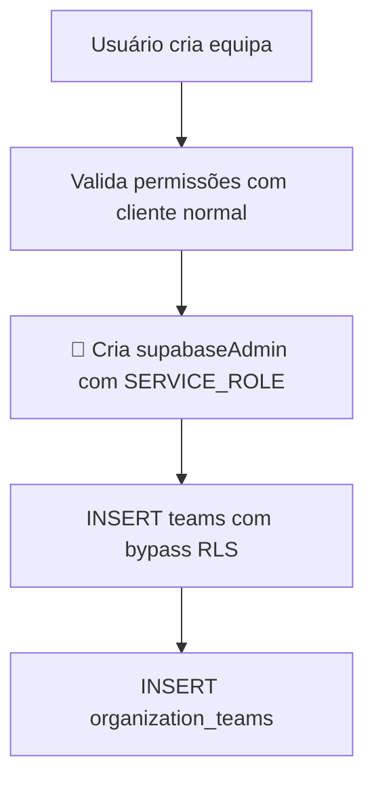
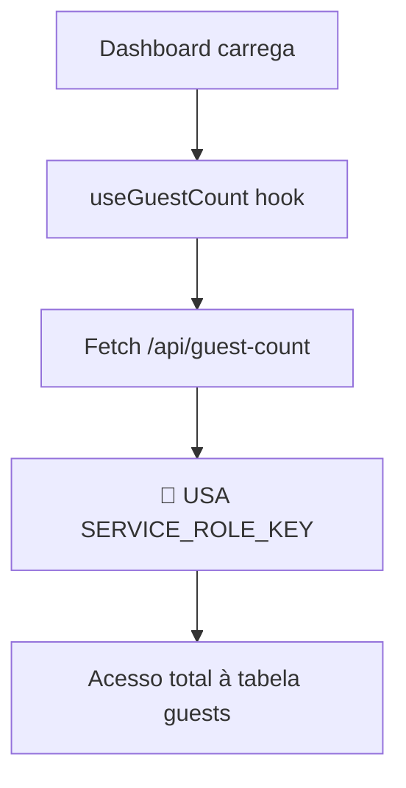

# 🛡️ PLANO COMPLETO DE CORREÇÃO DE SEGURANÇA
**Documento Técnico Detalhado - Plataforma SNAP**

---

## 📋 **ÍNDICE**
1. [Análise de Fluxos Críticos](#análise-de-fluxos-críticos)
2. [Mapeamento de Dependências](#mapeamento-de-dependências)
3. [Plano de Correção Faseado](#plano-de-correção-faseado)
4. [Estratégia de Rollback](#estratégia-de-rollback)
5. [Scripts de Implementação](#scripts-de-implementação)
6. [Testes de Validação](#testes-de-validação)

---

## 🔍 **ANÁLISE DE FLUXOS CRÍTICOS**

### **FLUXO 1: Associação de Equipas (organizerActions.ts)**

**📍 Arquivo:** `app/actions/organizerActions.ts`
**🔗 Usado por:** `app/app/organizador/equipes/page.tsx` (linha 269)

**FLUXO ATUAL:**
```mermaid
graph TD
    A[Organizador clica "Associar Equipa"] --> B[handleAssociateTeamByCode]
    B --> C[Cria FormData com teamCode + organizationId]
    C --> D[Chama associateTeamAction]
    D --> E[🚨 USA SERVICE_ROLE_KEY]
    E --> F[Bypassa RLS completamente]
    F --> G[UPDATE teams, INSERT organization_teams]
```

**PÁGINAS AFETADAS:**
- ✅ `app/app/organizador/equipes/page.tsx` - **FUNCIONALIDADE CRÍTICA**
- ✅ Usado apenas nesta página (confirmado)

**IMPACTO DE QUEBRA:** 🔴 **ALTO** - Funcionalidade essencial para organizadores

---

### **FLUXO 2: Criação de Equipas (teams/create API)**

**📍 Arquivo:** `app/api/teams/create/route.ts`
**🔗 Usado por:** 
- `app/app/organizador/equipes/page.tsx` (linha 217)
- `app/app/promotor/equipes/criar/page.tsx` (via RPC)
- `app/app/chefe-equipe/criar-equipe/page.tsx` (via RPC)

**FLUXO ATUAL:**


**PÁGINAS AFETADAS:**
- ✅ `app/app/organizador/equipes/page.tsx` - Criação via API
- ✅ `app/app/promotor/equipes/criar/page.tsx` - Criação via RPC
- ✅ `app/app/chefe-equipe/criar-equipe/page.tsx` - Criação via RPC

**IMPACTO DE QUEBRA:** 🔴 **ALTO** - 3 fluxos diferentes de criação

---

### **FLUXO 3: Contagem de Guests (guest-count APIs)**

**📍 Arquivos:** 
- `app/api/guest-count/route.ts`
- `app/api/guest-counts/route.ts`

**🔗 Usado por:** `hooks/useGuestCount.ts`

**FLUXO ATUAL:**


**PÁGINAS AFETADAS:**
- ✅ Dashboards de organizadores (estatísticas)
- ✅ Páginas de eventos (contadores)

**IMPACTO DE QUEBRA:** 🟡 **MÉDIO** - Dashboards podem falhar

---

## 🗺️ **MAPEAMENTO DE DEPENDÊNCIAS**

### **DEPENDÊNCIAS CRÍTICAS**

#### **organizerActions.ts**
```typescript
// ENTRADA
FormData {
  teamCode: string (formato TEAM-XXXXX)
  organizationId: string (UUID)
}

// VALIDAÇÕES ATUAIS
✅ Autenticação do usuário
✅ Formato do teamCode
❌ Permissão na organizationId
❌ Validação UUID organizationId

// OPERAÇÕES BD
1. SELECT teams WHERE team_code = ?
2. UPDATE teams SET organization_id = ?
3. INSERT organization_teams
4. INSERT user_organizations

// SAÍDA
{ success: boolean, message: string, teamName?: string }
```

#### **teams/create API**
```typescript
// ENTRADA
{ name: string, organizationId: string }

// VALIDAÇÕES ATUAIS
✅ Nome não vazio
✅ OrganizationId presente
✅ Usuário autenticado
✅ Permissão na organização (user_organizations)
❌ Rate limiting

// OPERAÇÕES BD
1. SELECT user_organizations (validação)
2. INSERT teams (SERVICE_ROLE)
3. INSERT organization_teams (SERVICE_ROLE)

// SAÍDA
{ success: boolean, teamId: string, teamCode: string }
```

---

## 📅 **PLANO DE CORREÇÃO FASEADO**

### **🔴 FASE 1: CORREÇÕES CRÍTICAS (0-2 dias)**

#### **1.1 Substituir organizerActions.ts por Função SQL Segura**

**NOVA IMPLEMENTAÇÃO:**
```sql
-- migrations/fix_associate_team_security.sql
CREATE OR REPLACE FUNCTION associate_team_organization_safely(
  team_code_param TEXT,
  organization_id_param UUID
) RETURNS JSON LANGUAGE plpgsql SECURITY DEFINER AS $$
DECLARE
  result JSON;
  team_record RECORD;
  user_org_record RECORD;
BEGIN
  -- 1. Verificar autenticação
  IF auth.uid() IS NULL THEN
    RETURN json_build_object('success', false, 'message', 'Não autenticado');
  END IF;
  
  -- 2. Verificar permissão na organização
  SELECT * INTO user_org_record 
  FROM user_organizations 
  WHERE user_id = auth.uid() 
    AND organization_id = organization_id_param
    AND role IN ('owner', 'admin');
    
  IF NOT FOUND THEN
    RETURN json_build_object('success', false, 'message', 'Sem permissão nesta organização');
  END IF;
  
  -- 3. Buscar e validar equipa
  SELECT * INTO team_record 
  FROM teams 
  WHERE team_code = team_code_param;
  
  IF NOT FOUND THEN
    RETURN json_build_object('success', false, 'message', 'Código de equipa inválido');
  END IF;
  
  -- 4. Verificar se já associada
  IF team_record.organization_id IS NOT NULL THEN
    IF team_record.organization_id = organization_id_param THEN
      RETURN json_build_object('success', false, 'message', 'Equipa já associada a esta organização');
    ELSE
      RETURN json_build_object('success', false, 'message', 'Equipa já pertence a outra organização');
    END IF;
  END IF;
  
  -- 5. Associar equipa (operação segura)
  UPDATE teams 
  SET organization_id = organization_id_param,
      updated_at = NOW()
  WHERE id = team_record.id;
  
  -- 6. Criar vínculo organization_teams
  INSERT INTO organization_teams (organization_id, team_id, created_at)
  VALUES (organization_id_param, team_record.id, NOW())
  ON CONFLICT DO NOTHING;
  
  -- 7. Adicionar criador como membro se não existir
  INSERT INTO user_organizations (user_id, organization_id, role, created_at)
  VALUES (team_record.created_by, organization_id_param, 'member', NOW())
  ON CONFLICT DO NOTHING;
  
  RETURN json_build_object(
    'success', true, 
    'message', 'Equipa associada com sucesso',
    'teamName', team_record.name
  );
  
EXCEPTION 
  WHEN OTHERS THEN
    RETURN json_build_object('success', false, 'message', 'Erro interno do servidor');
END; $$;

-- Conceder permissões adequadas
GRANT EXECUTE ON FUNCTION associate_team_organization_safely(TEXT, UUID) TO authenticated;
```

**NOVA IMPLEMENTAÇÃO organizerActions.ts:**
```typescript
"use server";

import { createClient } from '@/lib/supabase/server'

export async function associateTeamAction(formData: FormData): Promise<{ success: boolean; message: string; teamName?: string }> {
    
    const supabase = await createClient()

    // 1. Verificar autenticação
    const { data: { user }, error: userError } = await supabase.auth.getUser();
    if (userError || !user) {
        return { success: false, message: "Erro de autenticação. Por favor, faça login novamente." };
    }

    const teamCode = formData.get('teamCode') as string;
    const organizationId = formData.get('organizationId') as string;

    // 2. Validações básicas
    if (!teamCode || !organizationId) {
         return { success: false, message: "Código da equipa ou ID da organização em falta." };
    }

    // 3. Validar formato do código
    const teamCodePattern = /^TEAM-[A-Z0-9]{5}$/;
    if (!teamCodePattern.test(teamCode.trim())) {
        return { 
            success: false, 
            message: "Formato do código inválido. O código deve ter o formato TEAM-XXXXX." 
        };
    }

    // 4. Validar UUID da organização
    const uuidPattern = /^[0-9a-f]{8}-[0-9a-f]{4}-[0-9a-f]{4}-[0-9a-f]{4}-[0-9a-f]{12}$/i;
    if (!uuidPattern.test(organizationId)) {
        return { success: false, message: "ID da organização inválido." };
    }

    try {
        // 5. Chamar função SQL segura
        const { data, error } = await supabase.rpc('associate_team_organization_safely', {
            team_code_param: teamCode.trim(),
            organization_id_param: organizationId
        });

        if (error) {
            console.error("Erro na função SQL:", error);
            return { success: false, message: "Erro interno. Tente novamente." };
        }

        return data as { success: boolean; message: string; teamName?: string };

    } catch (error) {
        console.error("Erro na associação de equipa:", error);
        return { success: false, message: "Erro inesperado. Contacte o suporte." };
    }
}
```

#### **1.2 Corrigir Políticas RLS Críticas**

**CORREÇÃO GUESTS:**
```sql
-- migrations/fix_guests_rls_policies.sql

-- Remover políticas permissivas
DROP POLICY IF EXISTS "Permitir visualização de registros de convidados para usuários autenticados" ON guests;
DROP POLICY IF EXISTS "Permitir inserção de registros de convidados para usuários autenticados" ON guests;
DROP POLICY IF EXISTS "Permitir atualização de registros de convidados para usuários autenticados" ON guests;

-- Criar políticas restritivas e seguras
CREATE POLICY "guests_select_policy" ON guests FOR SELECT 
USING (
  -- Promotores podem ver guests que criaram
  promoter_id = auth.uid() OR
  -- Organizadores podem ver guests de seus eventos
  EXISTS (
    SELECT 1 FROM events e 
    JOIN user_organizations uo ON e.organization_id = uo.organization_id
    WHERE e.id = guests.event_id 
    AND uo.user_id = auth.uid()
    AND uo.role IN ('owner', 'admin')
  ) OR
  -- Scanners podem ver guests do evento que estão escaneando
  EXISTS (
    SELECT 1 FROM scanner_sessions ss
    JOIN event_scanners es ON ss.scanner_id = es.id
    WHERE es.event_id = guests.event_id
    AND ss.session_token = current_setting('request.jwt.claims', true)::json->>'session_token'
    AND ss.is_active = true
  )
);

CREATE POLICY "guests_insert_policy" ON guests FOR INSERT 
WITH CHECK (
  -- Apenas promotores autenticados podem criar guests
  auth.uid() IS NOT NULL AND
  promoter_id = auth.uid() AND
  -- Verificar se o evento existe e está ativo
  EXISTS (
    SELECT 1 FROM events 
    WHERE id = event_id 
    AND is_published = true
  )
);

CREATE POLICY "guests_update_policy" ON guests FOR UPDATE 
USING (
  -- Promotores podem atualizar seus próprios guests
  promoter_id = auth.uid() OR
  -- Scanners podem fazer check-in
  EXISTS (
    SELECT 1 FROM scanner_sessions ss
    JOIN event_scanners es ON ss.scanner_id = es.id
    WHERE es.event_id = guests.event_id
    AND ss.session_token = current_setting('request.jwt.claims', true)::json->>'session_token'
    AND ss.is_active = true
  )
);
```

### **🟠 FASE 2: CORREÇÕES ALTAS (2-5 dias)**

#### **2.1 Substituir teams/create API por Função SQL**

**NOVA FUNÇÃO SQL:**
```sql
-- migrations/fix_teams_create_security.sql
CREATE OR REPLACE FUNCTION create_team_organization_safely(
  name_param TEXT,
  organization_id_param UUID
) RETURNS JSON LANGUAGE plpgsql SECURITY DEFINER AS $$
DECLARE
  result JSON;
  team_id UUID;
  team_code TEXT;
  user_org_record RECORD;
BEGIN
  -- 1. Verificar autenticação
  IF auth.uid() IS NULL THEN
    RETURN json_build_object('success', false, 'message', 'Não autenticado');
  END IF;
  
  -- 2. Validar nome da equipa
  IF name_param IS NULL OR trim(name_param) = '' THEN
    RETURN json_build_object('success', false, 'message', 'Nome da equipa é obrigatório');
  END IF;
  
  -- 3. Verificar permissão na organização
  SELECT * INTO user_org_record 
  FROM user_organizations 
  WHERE user_id = auth.uid() 
    AND organization_id = organization_id_param
    AND role IN ('owner', 'admin');
    
  IF NOT FOUND THEN
    RETURN json_build_object('success', false, 'message', 'Apenas proprietários e administradores podem criar equipas');
  END IF;
  
  -- 4. Gerar ID e código únicos
  team_id := gen_random_uuid();
  team_code := 'TEAM-' || upper(substring(replace(team_id::text, '-', ''), 1, 4));
  
  -- 5. Inserir equipa
  INSERT INTO teams (id, name, team_code, organization_id, created_by, created_at, updated_at)
  VALUES (team_id, trim(name_param), team_code, organization_id_param, auth.uid(), NOW(), NOW());
  
  -- 6. Criar vínculo organization_teams
  INSERT INTO organization_teams (organization_id, team_id, created_at)
  VALUES (organization_id_param, team_id, NOW());
  
  RETURN json_build_object(
    'success', true,
    'teamId', team_id,
    'teamCode', team_code,
    'message', 'Equipa criada com sucesso'
  );
  
EXCEPTION 
  WHEN OTHERS THEN
    RETURN json_build_object('success', false, 'message', 'Erro interno do servidor');
END; $$;

GRANT EXECUTE ON FUNCTION create_team_organization_safely(TEXT, UUID) TO authenticated;
```

#### **2.2 Substituir guest-count APIs por RLS**

**NOVA IMPLEMENTAÇÃO:**
```typescript
// app/api/guest-count/route.ts
import { NextRequest, NextResponse } from 'next/server';
import { createClient } from '@/lib/supabase/server';

export async function GET(request: NextRequest) {
  try {
    const supabase = await createClient();
    
    // Verificar autenticação
    const { data: { user }, error: authError } = await supabase.auth.getUser();
    if (authError || !user) {
      return NextResponse.json({ 
        success: false,
        error: 'Não autorizado' 
      }, { status: 401 });
    }

    const { searchParams } = new URL(request.url);
    const eventId = searchParams.get('eventId');
    
    if (!eventId) {
      return NextResponse.json({ 
        success: false,
        error: 'ID do evento é obrigatório' 
      }, { status: 400 });
    }
    
    // Usar cliente normal - RLS irá filtrar automaticamente
    const { data: guestsData, error: guestsError, count: totalCount } = await supabase
      .from('guests')
      .select('*', { count: 'exact', head: false })
      .eq('event_id', eventId);
    
    if (guestsError) {
      return NextResponse.json({ 
        success: false,
        error: 'Erro ao buscar dados' 
      }, { status: 500 });
    }
    
    const { count: checkedInCount } = await supabase
      .from('guests')
      .select('*', { count: 'exact', head: true })
      .eq('event_id', eventId)
      .eq('checked_in', true);
    
    return NextResponse.json({
      success: true,
      count: totalCount || 0,
      checkedIn: checkedInCount || 0,
      timestamp: new Date().toISOString()
    });
    
  } catch (error) {
    return NextResponse.json({ 
      success: false,
      error: 'Erro interno do servidor' 
    }, { status: 500 });
  }
}
```

### **🟡 FASE 3: CORREÇÕES MÉDIAS (1-2 semanas)**

#### **3.1 Headers de Segurança**
#### **3.2 Rate Limiting**
#### **3.3 Sanitização SQL Completa**

---

## 🔄 **ESTRATÉGIA DE ROLLBACK**

### **ROLLBACK FASE 1**

#### **Script de Rollback organizerActions.ts:**
```sql
-- rollback/rollback_associate_team.sql
DROP FUNCTION IF EXISTS associate_team_organization_safely(TEXT, UUID);

-- Restaurar código original se necessário
-- (manter backup do arquivo original)
```

#### **Backup do Código Original:**
```bash
# Antes de qualquer alteração
cp app/actions/organizerActions.ts backup/organizerActions.ts.backup
cp app/api/teams/create/route.ts backup/teams-create-route.ts.backup
```

### **PLANO DE ROLLBACK POR ETAPAS**

1. **Rollback Imediato (< 5 min):**
   - Reverter arquivos TypeScript
   - Executar scripts SQL de rollback
   - Reiniciar aplicação

2. **Rollback com Dados (< 30 min):**
   - Restaurar políticas RLS originais
   - Verificar integridade dos dados
   - Testes de funcionalidade

3. **Rollback Completo (< 2 horas):**
   - Restaurar backup completo da BD
   - Reverter todas as alterações de código
   - Testes completos de regressão

---

## 🧪 **TESTES DE VALIDAÇÃO**

### **TESTES FASE 1**

#### **Teste 1: Associação de Equipas**
```typescript
// tests/security/associate-team.test.ts
describe('Associate Team Security', () => {
  test('Deve falhar sem autenticação', async () => {
    // Implementar teste
  });
  
  test('Deve falhar sem permissão na organização', async () => {
    // Implementar teste
  });
  
  test('Deve funcionar com permissões corretas', async () => {
    // Implementar teste
  });
});
```

#### **Teste 2: Políticas RLS**
```sql
-- tests/sql/test_guests_rls.sql
BEGIN;

-- Criar usuário de teste
INSERT INTO auth.users (id, email) VALUES ('test-user-1', 'test@example.com');

-- Testar política SELECT
SET LOCAL role authenticated;
SET LOCAL request.jwt.claims TO '{"sub": "test-user-1"}';

SELECT COUNT(*) FROM guests; -- Deve retornar apenas guests do usuário

ROLLBACK;
```

### **CHECKLIST DE VALIDAÇÃO**

#### **✅ Funcionalidades Críticas**
- [ ] Organizadores conseguem associar equipas
- [ ] Organizadores conseguem criar equipas
- [ ] Promotores conseguem criar equipas
- [ ] Dashboards mostram estatísticas corretas
- [ ] Sistema de scanner funciona

#### **✅ Segurança**
- [ ] SERVICE_ROLE_KEY removido de Server Actions
- [ ] Políticas RLS restritivas funcionam
- [ ] Usuários não autenticados são bloqueados
- [ ] Usuários sem permissão são bloqueados

#### **✅ Performance**
- [ ] Tempos de resposta mantidos
- [ ] Consultas BD otimizadas
- [ ] Cache funcionando

---

## 📊 **CRONOGRAMA DE IMPLEMENTAÇÃO**

### **SEMANA 1**
- **Dia 1-2:** Implementar Fase 1 (organizerActions + RLS guests)
- **Dia 3:** Testes intensivos Fase 1
- **Dia 4-5:** Implementar Fase 2 (teams/create + guest-count)

### **SEMANA 2**
- **Dia 1-2:** Testes intensivos Fase 2
- **Dia 3-5:** Implementar Fase 3 (headers, rate limiting)

### **SEMANA 3**
- **Dia 1-3:** Testes completos de regressão
- **Dia 4-5:** Deploy gradual em produção

---

## 🚨 **ALERTAS E MONITORIZAÇÃO**

### **Métricas Críticas**
- Taxa de erro em associações de equipas
- Tempo de resposta das APIs
- Falhas de autenticação
- Violações de políticas RLS

### **Alertas Automáticos**
- Erro > 5% em qualquer funcionalidade crítica
- Tempo resposta > 2x baseline
- Tentativas de bypass de segurança

---

## ✅ **APROVAÇÃO E EXECUÇÃO**

**Documento aprovado por:** _________________
**Data de aprovação:** _________________
**Responsável pela implementação:** _________________

**Status de execução:**
- [ ] Fase 1 completa
- [ ] Fase 2 completa  
- [ ] Fase 3 completa
- [ ] Testes de validação passaram
- [ ] Deploy em produção

---

*Este documento garante que todas as correções de segurança serão implementadas de forma segura, sem quebrar funcionalidades existentes, e com possibilidade de rollback completo.*